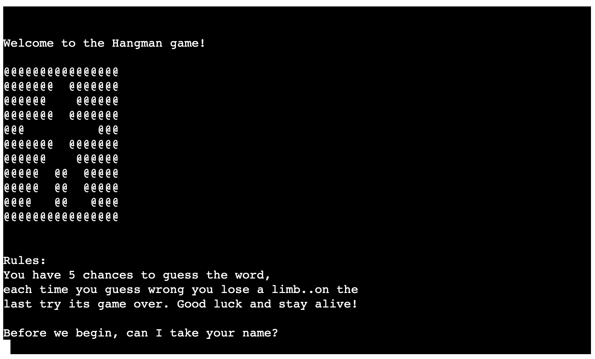
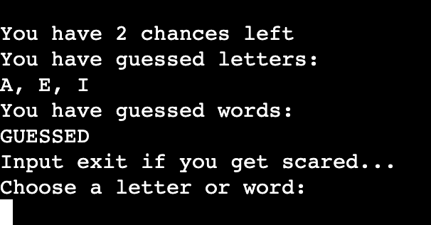
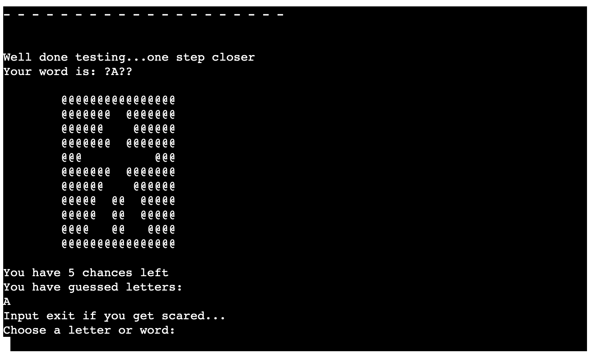
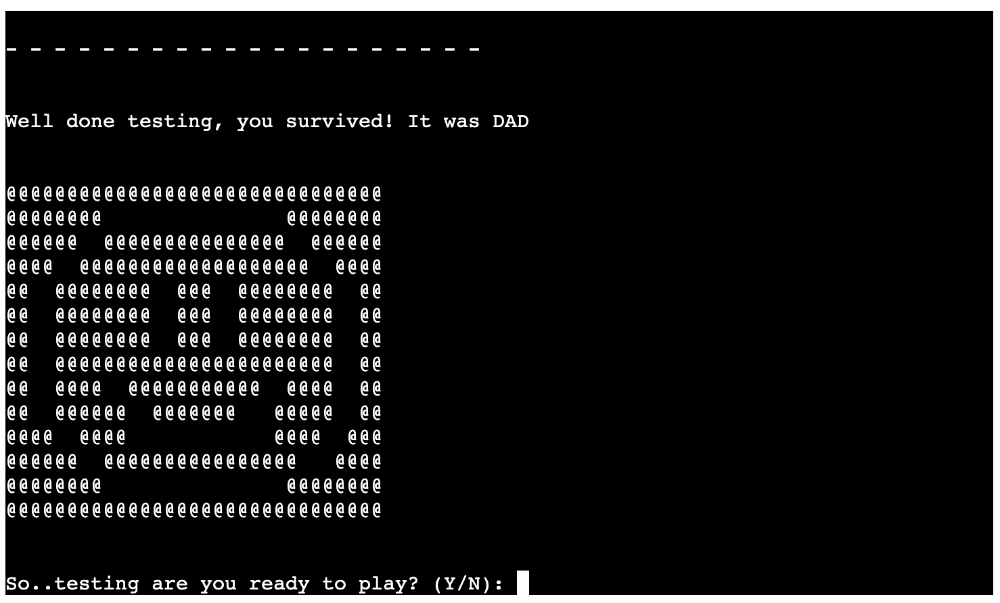
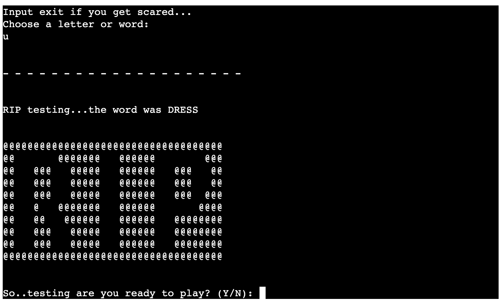
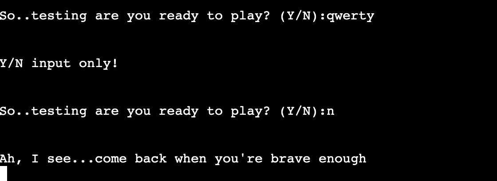

# Hangman

This is a twist on the common hangman game, the concept is similar however in this version your character loses limbs rather than drawing a line each time. 

It is a Python terminal game, which is playable on a mock terminal on Heroku.

Click [here](https://debbie-herridge-hangman.herokuapp.com/) to play the game!

## How to play

Similar to the classic hangman game, the player will be given question mark for each letter in the word, for each round the player will guess either a letter or word. If their letter is correct the black spaces in the word will change to that letter, if they guess wrong they lose a lifeline.

In this version, after the player enters their name to commence the game, the hangman character takes the chosen name and with each wrong guess the player will lose a limb. 

The player will only survive if they guess the word before losing all 5 lives.

## Features 

### Game word
The words are randomly pulled from a Python file containing over 1000 words in a list format, this word is then converted into question marks. If the user guess a right letter the question mark will change to be populated with the correct letter.

### Statistics
There is game statistics that update each round, it shows the user:
- How many chances they have left to guess
- The letters or words they have previously guessed

### Visual feedback
If the player loses a life they will be prompted with a message to say that they have lost a limb. Providing the player has entered their name in the beginning, this message will feel personal to them.

There is also a terminal image of said charater losing a limb each time for a visual representation, the more they guess wrong the more limbs the charater loses until game over.

If the player wins they are given a smiley face with a prompt to play again.

If the player dies in game they are given a RIP image, again with a prompt below to play again.

### Input validation
If the player guesses the same guess they will be prompted to guess again. Same applies to when the user guesses either a word not the same length as the chosen game word, or when they input something other than a letter.

Or if the player inputs something other than Y/N when asked to commence the game an error will print out onto the terminal, if the player says 'n' they will have a goodbye message.

### Game exit
The player can input exit at any time to quit the current game, this can be used if the player want a different word, they will be prompted if they want to play again or quit entirely.

### Future features

- Link to a google sheet with names and scores to keep track of high scores

## Testing

This game has been manually tested in both the GitPod terminal and in the Heroku mock terminal app. It has been played multiple times by different people, with inputs such as special charactors and repeat playing.

### Bugs

Initially there were errors in the project when trying to get the displayed word to populate with the correct letters when chosen, this was fixed by adding the printed word within the game function. This has now been fixed and will display accordingly.

A bug was found after the player had guessed the word the word will still show after displaying the win or lose function as this was called in the play function, therefore after displaying win or lose it would go back to finish the play function. By using a break in the if statement this solved this issue.

The game word was legible on GitPod's terminal as there was a slight gap between the original underscores, however when deployed and played on Heroku it was no longer clear how many letters where in the word. Therefore by replaying the '_' with '?' it is very clear how many letters the player had to guess.

From repeat testing there have been no other bugs found.

## Deployment

This project was created on GitPod and deployed onto Heroku using the CodeInstitute template.
- Create new app on Heroku
- Use a new specific name for the app and change country 
- In settings set buildbacks to Python and NodeJS in that order
- On the deploy section connect to personal GitHub account
- Search for repository name and connect

## Credits

This project is playable on the mock terminal thanks to CodeInstitues template.

### Websites for code

[Stack - Picking a random word from the list](https://stackoverflow.com/questions/594273/how-to-pick-a-random-english-word-from-a-list)

[Stack - Displaying list items](https://stackoverflow.com/questions/11178061/print-list-without-brackets-in-a-single-row)

[Stack - Input name only](https://stackoverflow.com/questions/39199188/how-do-i-only-allow-letters-when-asking-for-a-name-in-python)

### Video Tutorials

[YouTube creator Kite - Hangman game tutorial](https://www.youtube.com/watch?v=m4nEnsavl6w&t=527s)